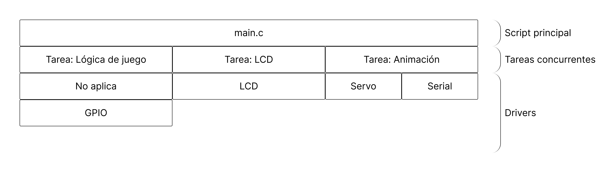
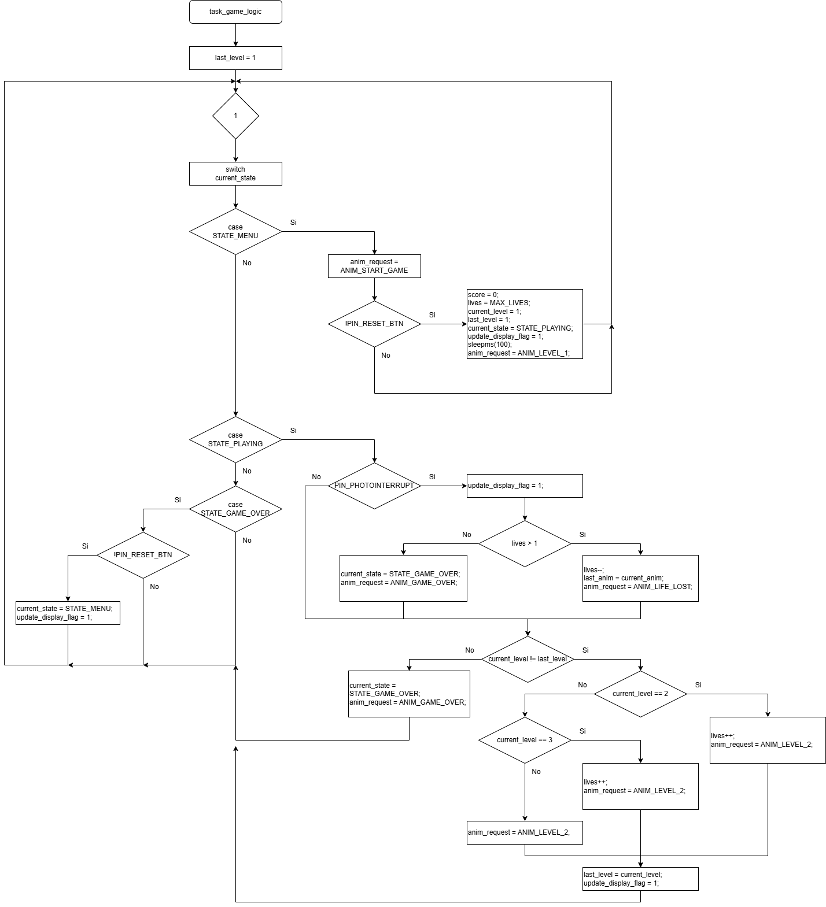
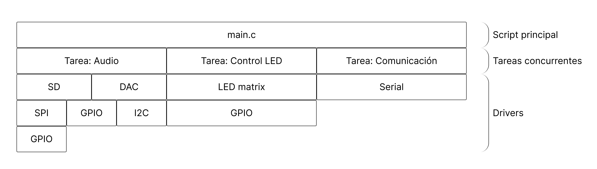
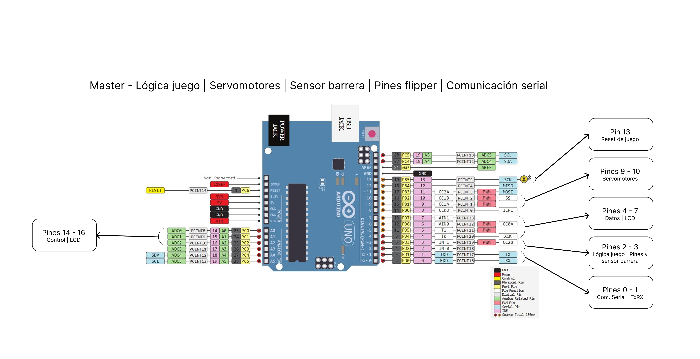

# Pinball RTOS – Sistema Embebido con Xinu para AVR

Proyecto final de las asignaturas **Diseño de Sistemas con Microcontroladores** y **Programación de Sistemas Embebidos**.

## Descripción General

Este proyecto aborda el diseño, desarrollo e implementación de un juego electromecánico tipo **Pinball (Flipper)** utilizando una arquitectura distribuida basada en dos microcontroladores **ATmega328p** (Master y Slave). Ambos ejecutan una versión portada del sistema operativo de tiempo real **Xinu**, adaptada para operar en hardware con recursos limitados (2 KB de RAM).

El trabajo demuestra la viabilidad de ejecutar un RTOS en un microcontrolador de 8 bits, gestionando concurrencia, comunicación asíncrona y control de periféricos en tiempo real. El sistema completo se integró en una carcasa diseñada e impresa en 3D.

## Arquitectura del Sistema

El sistema utiliza un esquema **Maestro–Esclavo** comunicado mediante **UART**. Ambos ATmega328p ejecutan Xinu, encargándose de distintas tareas concurrentes.

---

## Master (Lógica y Control)

**Figura 1:** Diagrama de tareas concurrentes en Xinu (Master y Slave).

El Master administra la lógica completa del juego y la interfaz de usuario.

### Funciones Principales

* **Gestión de Reglas:** Manejo de vidas, puntaje y progresión de niveles.
* **Actuadores:** Control de dos servomotores SG90 mediante **PWM**.
* **Sensores:**

  * Detección de puntaje a través de **INT0**.
  * Detección de pérdida de vida mediante una barrera infrarroja.
* **Interfaz:** Control de una pantalla **LCD 16x02**.
* **Coordinación:** Envío de comandos de efectos al Slave.

**Figura 2:** Diagrama de flujo de la tarea principal del Master.

---

## Slave (Multimedia y Efectos)

**Figura 3:** Diagrama de flujo de tareas de Audio y Luces del Slave.

El  Slave gestiona tareas intensivas en I/O y temporización.

### Funciones Principales

* **Audio:** Reproducción de audio PCM de 8 bits desde tarjeta MicroSD (SPI) mediante un **DAC MCP4725** (I2C).
* **Iluminación:** Control de una matriz de LEDs multiplexada.
* **Comunicación:** Recepción continua de comandos UART desde el Master.

---

## Tecnologías y Drivers Desarrollados

El proyecto fue implementado íntegramente en lenguaje **C**, sin utilizar librerías externas, para maximizar control sobre el hardware y asegurar un uso eficiente de memoria. Se empleó una arquitectura por capas, con drivers de alto y bajo nivel.

### Drivers de Bajo Nivel

Drivers escritos mediante manipulación directa de registros del ATmega328p:

* **GPIO:** Manejo de puertos B, C y D con abstracción de pines.
* **SPI:** Comunicación con la tarjeta MicroSD.
* **I2C (TWI):** Control del DAC MCP4725.
* **UART:** Comunicación serial asíncrona a 9600 baudios.
* **Timer 1:** Configuración en modo **Fast PWM** para el control de servomotores.
* **Interrupciones:** Manejo de ISRs para eventos críticos (audio y puntaje).

### Drivers de Alto Nivel

* **Tarjeta SD:** Implementación del protocolo SPI Mode para inicialización y lectura de bloques (SDHC/SDSC).
* **DAC MCP4725:** Implementación del protocolo de transmisión de audio.
* **LCD 16x2:** Controlador en modo de 4 bits.
* **Servo:** Conversión de posición (grados) a ciclo de trabajo PWM.

---

## Protocolo de Comunicación

La comunicación entre microcontroladores es **unidireccional (Master → Slave)** tras una verificación inicial. Para minimizar latencia y uso de CPU, se define un conjunto de comandos de un byte.

| Comando | Acción       | Descripción                                                                   |
| ------- | ------------ | ----------------------------------------------------------------------------- |
| 'A'     | Verificación | Único mensaje enviado por el Slave al iniciar para indicar "Listo".           |
| 'B'     | Play         | Inicia reproducción de música de fondo.                                       |
| 'C'     | Pause        | Detiene la reproducción de música.                                            |
| U–Z     | Patrones     | Selecciona diferentes secuencias de iluminación (p. ej., parpadeo, barridos). |
| 1–3     | Velocidad    | Ajusta la velocidad de animación LED (1=lento, 3=rápido).                     |

---

## Desafíos y Soluciones

### 1. Gestión de Memoria en Xinu (2 KB RAM)

Ejecutar el kernel, los stacks de las tareas y los buffers de audio simultáneamente presentó un desafío significativo en el desarrollo del código del microcontrolador **slave**.

**Solución:**
Implementación de lectura parcial de bloques de la SD (lectura física de 512 bytes, almacenamiento en buffers reducidos). Optimización manual del tamaño de cada stack de tarea.

### 2. Jitter en Servos

El control de servos por software generaba jitter debido a contención con tareas del RTOS.

**Solución:**
Migración del control de servos a **Timer 1 en modo Hardware PWM**.

---

## Hardware y Conexiones

Todo el hardware se integró en una carcasa personalizada e impresa en 3D (PLA).

### Diagramas de Conexión

* **Master**

* **Figura 4:** Diagrama de conexiones del Master.

* **Slave**

* **Figura 5:** Diagrama de conexiones del Slave.

---

## Autor

Proyecto desarrollado como trabajo final de las asignaturas:

**“Diseño de Sistemas con Microcontroladores”**
**“Programación de Sistemas Embebidos”**

**Subrini Simón – ING-7326**
Facultad de Ingeniería – 2025

